# Mermaid Diagrams for Web Rendering
## Interactive Visualizations for Documentation & Presentations

**Purpose**: Web-renderable versions of key bardic memory diagrams using Mermaid.js syntax.

**Usage**: Paste these into:
- GitHub markdown (auto-renders)
- Notion (using `/code` block with `mermaid` language)
- Obsidian (with Mermaid plugin)
- Custom documentation sites (mkdocs, docusaurus, etc.)

---

## Diagram 1: Bardic Memory Retrieval Protocol

```mermaid
graph TD
    A[User Message:<br/>'I'm feeling that old fear again...'] --> B[Stage 1: RECOGNITION]

    B --> B1[Embed current message → vector]
    B1 --> B2[Query episode_vectors<br/>for similarity]
    B2 --> B3[Check affect_valence/<br/>arousal match]
    B3 --> B4[Detect dominant<br/>element pattern]
    B4 --> C{Resonance<br/>Detected?}

    C -->|Yes| D[Stage 2: RE-ENTRY]
    C -->|No| Z[Continue conversation<br/>without memory recall]

    D --> D1[Retrieve matched episode]
    D1 --> D2[Present scene_stanza<br/>≤300 chars]
    D2 --> D3[Reconstruct sense_cues<br/>place/smell/sound]
    D3 --> D4{Check<br/>affect_arousal<br/>>0.7?}

    D4 -->|Yes| D5[Request permission:<br/>'May I step in with you?']
    D4 -->|No| E[Stage 3: RECALL]
    D5 --> D6{Permission<br/>granted?}
    D6 -->|Yes| E
    D6 -->|No| Z

    E --> E1[Load full episode details]
    E1 --> E2[Retrieve linked episodes<br/>episode_links]
    E2 --> E3[Surface active teloi<br/>future pressures]
    E3 --> E4[Show microacts observed<br/>virtue building]
    E4 --> E5[Present narrative threads]
    E5 --> F[Integration:<br/>User has access to<br/>living story]

    style B fill:#ff6b6b
    style D fill:#4ecdc4
    style E fill:#45b7d1
    style F fill:#96ceb4
```



---

## Diagram 2: Fire-Air Temporal Bridge

```mermaid
graph LR
    subgraph PFC[Prefrontal Cortex - Temporal Processing]
        subgraph FIRE[🔥 FIRE Right PFC]
            F1[Future → Present]
            F2[Imaginal Mode]
            F3[Pattern-before-form]
            F4[What wants to be born]
            F5[Seer/Prophet]
        end

        subgraph AIR[🌬️ AIR Left PFC]
            A1[Past → Present]
            A2[Relational Mode]
            A3[Form-before-pattern]
            A4[What has been spoken]
            A5[Bard/Philosopher]
        end
    end

    FIRE --> INTEGRATION[Conscious Participation<br/>in Time]
    AIR --> INTEGRATION

    INTEGRATION --> CO[Co-create Destiny]

    style FIRE fill:#ff6b6b
    style AIR fill:#4ecdc4
    style INTEGRATION fill:#ffd93d
    style CO fill:#96ceb4
```



---

## Diagram 3: Episode Data Structure


---

## Diagram 4: Six UX Microflows

```mermaid
graph TB
    USER[User] --> DRAWER[🚪 Open the Drawer]
    USER --> FIRE[🔥 Fire Query]
    USER --> AIR[🌬️ Air Query]
    USER --> MADELEINE[🌊 Madeleine Trigger]
    USER --> VIRTUE[🌍 Virtue Ledger]
    USER --> SACRED[🜃 Sacred Witness]

    DRAWER --> D1[Search place_cue + sense_cues]
    D1 --> D2[Return matching episodes<br/>with scene_stanzas]
    D2 --> D3[Portal-based navigation]

    FIRE --> F1[Query teloi table]
    F1 --> F2[Find active future pressures]
    F2 --> F3[Suggest 48-hour<br/>crystallization moves]

    AIR --> A1[Scan episode_links]
    A1 --> A2[Find unresolved patterns]
    A2 --> A3[Suggest completion rituals]

    MADELEINE --> M1[Search cues by value]
    M1 --> M2[Reconstruct sensory scene]
    M2 --> M3[Include music if available]

    VIRTUE --> V1[Query microacts]
    V1 --> V2[Group by action_phrase]
    V2 --> V3[Show 30-day patterns]

    SACRED --> S1[Create episode with<br/>sacred_flag = true]
    S1 --> S2[NO embedding created]
    S2 --> S3[Pure witness response]

    style DRAWER fill:#4ecdc4
    style FIRE fill:#ff6b6b
    style AIR fill:#95e1d3
    style MADELEINE fill:#74b9ff
    style VIRTUE fill:#fdcb6e
    style SACRED fill:#dfe6e9
```



---

## Diagram 5: Database Schema Relationships


---

## Diagram 6: Implementation Timeline


---

## Diagram 7: Traditional vs Bardic Memory

```mermaid
graph TD
    subgraph TRADITIONAL[Traditional AI Memory]
        T1[User: 'I'm scared']
        T1 --> T2[Keyword search: 'scared']
        T2 --> T3[Database query]
        T3 --> T4[Return chronological list]
        T4 --> T5[You said 'scared' on<br/>2024-12-03, 2024-11-15...]

        style T1 fill:#e74c3c
        style T5 fill:#e74c3c
    end

    subgraph BARDIC[Bardic Memory]
        B1[User: 'I'm scared']
        B1 --> B2[Embed message → vector]
        B2 --> B3[Morphic resonance search]
        B3 --> B4[Match affect + place + element]
        B4 --> B5[RECOGNITION:<br/>'This resonates with<br/>October lake threshold...']
        B5 --> B6[RE-ENTRY:<br/>Present scene_stanza<br/>with sensory cues]
        B6 --> B7[RECALL:<br/>Full episode with<br/>narrative threads]

        style B1 fill:#2ecc71
        style B7 fill:#2ecc71
    end

    TRADITIONAL -.->|Mechanical<br/>Retrieval| R1[Information about past]
    BARDIC -.->|Morphic<br/>Resonance| R2[Living story<br/>participation]

    style R1 fill:#95a5a6
    style R2 fill:#f39c12
```



---

## Diagram 8: Elemental Pentagram


---

## Diagram 9: User Journey - Therapy Session


---

## Embedding Instructions

### GitHub Markdown
Simply paste the code blocks with ```mermaid fence. They auto-render.

### Notion
1. Type `/code`
2. Select "Mermaid" as language
3. Paste diagram code

### Obsidian
1. Install "Mermaid" plugin
2. Create code fence with ```mermaid
3. Paste diagram code

### Custom Sites (MkDocs, Docusaurus)
Enable mermaid plugin in config, then use standard code fences.

### Export as Image
Use [Mermaid Live Editor](https://mermaid.live/):
1. Paste code
2. Click "Actions" → "Export SVG/PNG"
3. Use in presentations

---

## Interactive Features

These diagrams support:
- **Hover tooltips**: (in some renderers)
- **Click-to-expand**: (if configured)
- **Dynamic data**: Can be generated from actual DB queries
- **Theme support**: Light/dark mode compatible

---

*Mermaid diagrams prepared: January 7, 2025*
*For: Web documentation, GitHub, Notion, presentations*

🔥🌬️🌊🌍🜃
