# 🜃 Unified Akashic Field Architecture

**Visual diagrams and technical architecture for SL-2025-02**

---

## System Architecture Diagram

```mermaid
graph TB
    subgraph "Wisdom Sources"
        MAIA[🎙️ MAIA Conversations<br/>Voice + Text]
        Mirror[🜂 Claude Mirror<br/>Reflections]
        Astro[🌟 Astrology<br/>Charts + Transits]
        Journal[📄 Journals<br/>Field Notes]
        Div[🔮 Divination<br/>Tarot + I Ching]
        Docs[📂 Documents<br/>Uploads]
    end

    subgraph "Classification Layer"
        Elem[Element Detection<br/>Fire/Water/Earth/Air/Aether]
        Arch[Archetype Detection<br/>Oracle/Guide/Shadow/etc.]
    end

    subgraph "Storage & Embedding"
        DB[(PostgreSQL<br/>insight_history)]
        Vector[Vector Embeddings<br/>text-embedding-3-small<br/>1536 dimensions]
    end

    subgraph "Search & Retrieval"
        API[Akashic Query API<br/>/api/akashic/query]
        PGV[pgvector<br/>Cosine Similarity]
    end

    subgraph "User Interface"
        Query[Semantic Search<br/>Natural Language]
        Filters[Filters<br/>Element/Archetype/Source/Time]
        Results[Cross-Source<br/>Synthesis]
    end

    MAIA -->|saveMaiaToAkashic| Elem
    Mirror -->|saveMirrorInsight| Elem
    Astro -->|saveAstrologyToAkashic| Elem
    Journal -->|saveDocumentToAkashic| Elem
    Div -->|saveDivinationToAkashic| Elem
    Docs -->|saveDocumentToAkashic| Elem

    Elem --> Arch
    Arch --> DB
    DB --> Vector
    Vector --> PGV

    Query --> API
    Filters --> API
    API --> PGV
    PGV --> Results
```



---

## Data Flow Diagram


---

## Element Classification Pipeline

```mermaid
graph LR
    Input[Content Text] --> RegexMatch[Regex Pattern<br/>Matching]
    RegexMatch --> SourceCheck{Source Type?}

    SourceCheck -->|MAIA/Mirror| KeywordScore[Keyword Scoring]
    SourceCheck -->|Astrology| ChartBalance[Chart Elemental<br/>Balance]
    SourceCheck -->|Tarot| SuitMap[Suit Mapping<br/>Wands→Fire, etc.]
    SourceCheck -->|Journal| KeywordScore

    KeywordScore --> Element[Element<br/>Fire/Water/Earth/Air/Aether]
    ChartBalance --> Element
    SuitMap --> Element

    Element --> Database[(insight_history)]
```



---

## Archetype Detection Pipeline


---

## Cross-Source Query Architecture

```mermaid
graph TB
    User[User Query:<br/>"insights about transformation"]

    User --> API[Akashic Query API]
    API --> Embed[Generate Query<br/>Embedding]
    Embed --> Vector[text-embedding-3-small<br/>1536 dimensions]

    Vector --> PGVector[pgvector<br/>Similarity Search]
    PGVector --> Filter{Apply Filters}

    Filter -->|Element| Fire[Fire Insights]
    Filter -->|Archetype| Alchemist[Alchemist Insights]
    Filter -->|Source| Multi[Multi-Source<br/>Results]

    Fire --> Results
    Alchemist --> Results
    Multi --> Results

    Results[Ranked Results<br/>by Similarity]

    Results --> Display[Cross-Source<br/>Synthesis]

    Display --> U1[🎙️ MAIA: "breakthrough..."]
    Display --> U2[🔮 Tarot: Tower + Death]
    Display --> U3[🌟 Astrology: Pluto transit]
    Display --> U4[📄 Journal: "finally let go..."]
```

---

## Database Schema Visualization


**Indexes:**
- `idx_insight_source` (source, source_type)
- `idx_insight_element` (element)
- `idx_insight_archetype` (archetype)
- `idx_insight_user` (user_id)
- `idx_insight_embedding` USING ivfflat (embedding vector_cosine_ops)

---

## Integration Pattern: MAIA Dual-Save


---

## Temporal Clustering Visualization


**Pattern:** All sources converge on Fire/Alchemist within tight temporal window → Field-level transformation event

---

## Source Integration Status

```mermaid
graph LR
    subgraph "Active (4)"
        M[🎙️ MAIA<br/>✅ Live]
        CM[🜂 Mirror<br/>✅ Live]
        A[🌟 Astrology<br/>✅ Integrated]
        J[📄 Journals<br/>✅ Integrated]
    end

    subgraph "Ready (1)"
        D[🔮 Divination<br/>⏳ Functions Ready]
    end

    subgraph "Partial (1)"
        DC[📂 Documents<br/>🔧 Upload Exists]
    end

    M --> Field[Unified<br/>Akashic Field]
    CM --> Field
    A --> Field
    J --> Field
    D -.->|To Be Called| Field
    DC -.->|Needs Analysis| Field

    Field --> Search[Semantic<br/>Search API]
```



---

## Element Distribution (Conceptual)


*Note: Actual distribution will vary by user and evolve over time*

---

## Archetype Network (Conceptual)


*Arrows show developmental relationships between archetypes*

---

## Technology Stack


---

## Research Status Pipeline


---

**🜃 Unified Akashic Field Architecture Diagrams**
**SL-2025-02 Supporting Documentation**
**Generated:** 2025-10-23
**Status:** Reference Documentation for Research Paper
